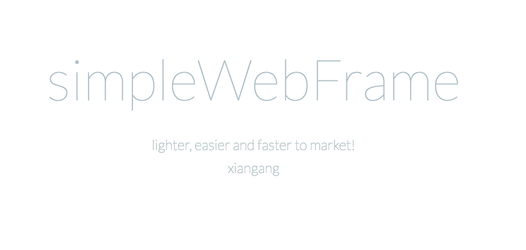

# simpleWebFrame
本框架是各种开发模式的基础上实现了单入口的web服务框架，可以用来开发API。

## 结构介绍

| 文件夹 | 用途 |
| --- | --- |
| controller | 存放用户编写的处理HTTP请求的类,其中`Controller.php`为控制器极类`ControllerResolver.php`为HTTP请求映射器 |
| config | 文件 `config.php`存放系统的配置信息，如数据库连接信息等 |
| dispatcher | 统一处理接收的HTTP请求 |
| public | 系统入口处，系统为单一入口文件`index.php` |
| registry | 注册表类，提供系统配置信息、请求信息的全局访问，其中`ApplicationRegistry.php`提供系统信息，`RequestRegistry.php`提供请求信息 |
| request | 封装的HTTP请求 |
| view | 视图层文件 |

## 使用方法

1. 从GitHub上clone本项目的代码到本地

2. 运行`composer install`

3. 将代码部署到本地Web服务器，把`simpleWebFrame\public`设置为`DocumentRoot`。可以使用PHP内置的Web服务器快速部署验证：进入到目录`simpleWebFrame\public`，运行命令`php -S localhost:8000`，启动成功之后，打开浏览器输入网址：`localhost:8000`即可看到欢迎页面！

4.  如果需要写新的`Controller`，在`controller`文件夹创建命名为`xxxController.php`的类即可

## 访问方法

如果在在`controller`文件夹创建命名为`InfoController.php`的类，同时在类中创建了`info()`方法，那么通过URL：`localhost:8000/Info/info`就能访问到改方法 

## 后续

目前还没有视图解析器...

